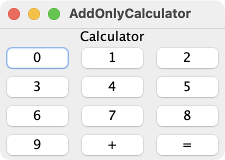
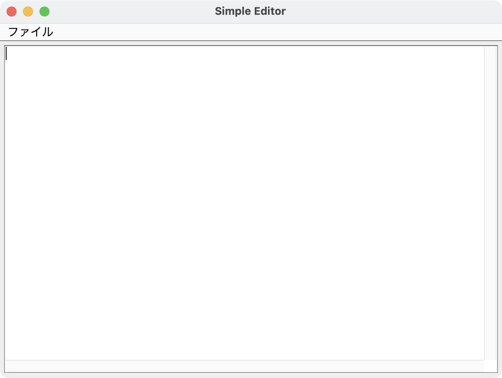
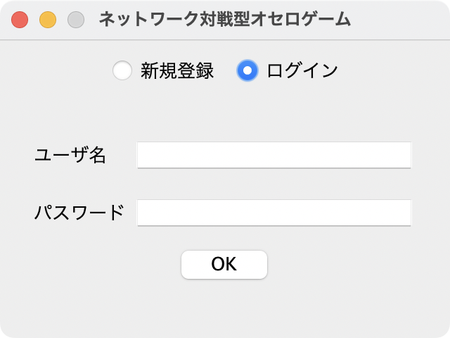
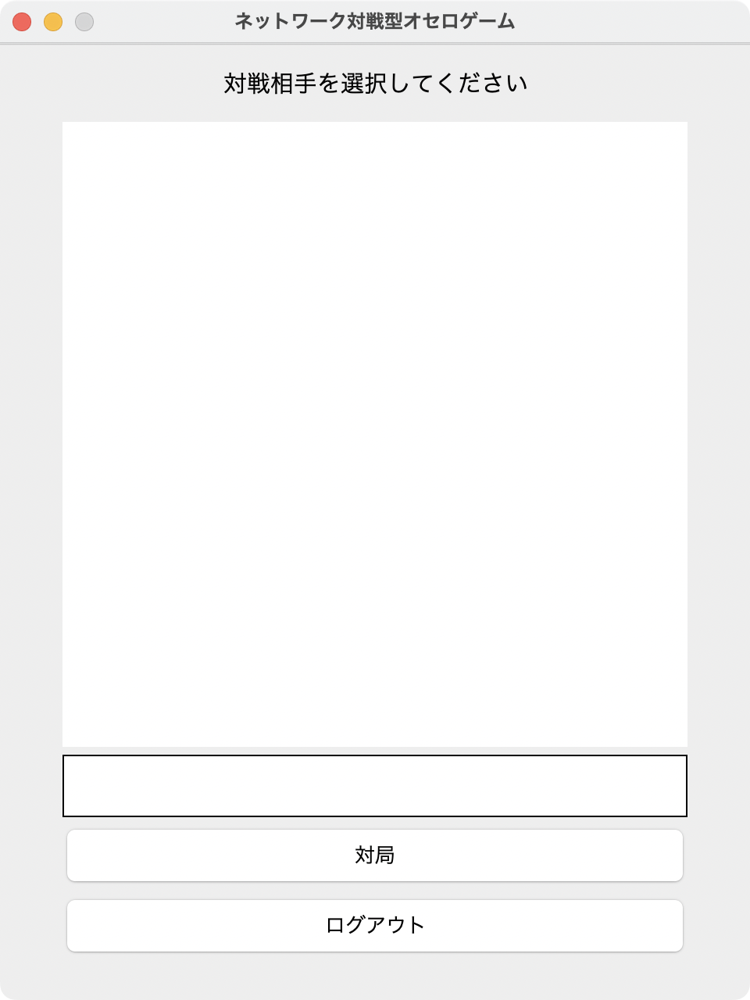
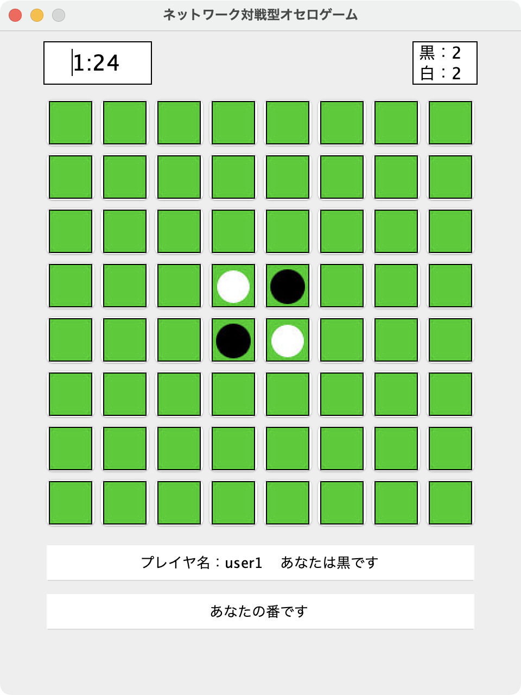

# Javaのサンプルコード

学部にいるときに書いたJavaアプリケーション．

プログラミング言語の授業でModel，View，Controllerの設計（MVC）というのを知って，使ってみたかったというだけで無理やりMVCを使ってます．

簡単なMVCのサンプルプログラムと少し複雑なリバーシゲームのプログラムです．

そこまで深く考えずに作ったので，あまり出来のいいものではないです．

---

目次

[MVCのサンプルプログラム](#mvcのサンプルプログラム)  
\- [2数の加算のみを行う計算機](#2数の加算のみを行う電卓)  
\- [簡易的なテキストエディタ](#簡易的なテキストエディタ)  
[リバーシ（ゲーム）](#リバーシゲーム)  
\- [サーバプログラム](#サーバプログラム)  
\- [クライアントプログラム](#クライアントプログラム)

---

# MVCのサンプルプログラム

## 2数の加算のみを行う電卓

ソースコード：[AddOnlyCalculator.java](mvc_samples/AddOnlyCalculator.java)

### コンパイル

```bash
$ javac AddOnlyCalculator.java
```

### 起動方法

```bash
$ java AddOnlyCalculator
```

### GUI

 

## 簡易的なテキストエディタ

ソースコード：[SimpleEditor.java](mvc_samples/SimpleEditor.java)

### コンパイル

```bash
$ javac SimpleEditor.java
```

### 起動方法

```bash
$ java SimpleEditor
```

### GUI

 

---

# リバーシ（ゲーム）

\* クライアントプログラムを2つ以上実行しないと遊べません．

## サーバプログラム

ソースコード：[Server.java](othello_game/Server.java)，[ClientManager.java](othello_game/ClientManager.java)

### コンパイル

```bash
$ javac Server.java ClientManager.java
```

### 起動方法

```bash
$ java Server
```

\* 起動すると~~意味のない~~パスワードの入力が求められます．`123456`を入力してください．  
\* `Ctrl+C`で終了

## クライアントプログラム

ソースコード：[Client.java](othello_game/Client.java)，[PlayerModel.java](othello_game/PlayerModel.java)，[PlayerView.java](othello_game/PlayerView.java)，[PlayerController.java](othello_game/PlayerController.java)，[OthelloModel.java](othello_game/OthelloModel.java)，[OthelloView.java](othello_game/OthelloView.java)，[OthelloController.java](othello_game/OthelloController.java)，[Clock.java](othello_game/Clock.java)

### コンパイル

```bash
$ javac Client.java PlayerModel.java PlayerView.java PlayerController.java OthelloModel.java OthelloView.java OthelloController.java Clock.java
```

### 起動

```bash
$ java Client [ip address] 8004
```

localhost(127.0.0.1)でサーバを起動している場合

```bash
$ java Client localhost 8004
```

または

```bash
$ java Client 127.0.0.1 8004
```

\* ポート番号8004でサーバを稼働させているので，引数として指定しています．  
\* 画像ファイル(.jpg)はクラスファイル(.class)と同じディレクトリに配置してください．  
\* `Ctrl+C`かログイン画面のウインドウを閉じると終了します．

### GUI



 
